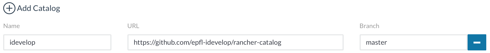

EPFL Rancher Catalog
====================

This repository contains a Rancher Catalog used in the Container as a Service (CaaS.epfl.ch) Rancher Cluster.

This catalog contains multiple templates:
 - [infra-template/lvmnfs](https://github.com/epfl-idevelop/rancher-template-lvmnfs) to provide a Generic Storage with Quota for the containers
 - [templates/mysql](https://github.com/epfl-idevelop/rancher-template-mysql) for the DBaaS (AKA "AMM") Service
 - [templates/redis-sentinel](https://github.com/epfl-idevelop/rancher-template-redis-sentinel) to provide a key-value storage for the API layer
 - *Coming soon* : [templates/wwp](https://github.com/epfl-idevelop/rancher-template-wwp) to provide wordpress CMS with EPFL theme and supported plugins

## How to use

In order to use this catalog, simply add it to your Rancher server (Admin → Settings → Add Catalog):

(c) All rights reserved. ECOLE POLYTECHNIQUE FEDERALE DE LAUSANNE, Switzerland, VPSI, 2017
